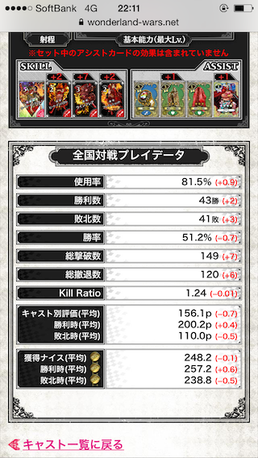

WLWブックマークレット
====

本ブックマークレットでは、&copy;SEGAが提供するWonderland Warsにおける[Wonderland.NET](https://wonderland-wars.net/)のマイキャストページの表示をカスタマイズする機能を提供します。



本機能では次の内容を実現します。
* 勝率など通常では表示されない項目の表示する機能※1  
* プレイ結果による各項目の差分を表示する機能※2  
※1: 勝利数、キャスト別評価から計算した結果なので、正確な数値でない可能性があります。  
※2: Cookieに前回のブックマークレットの実行結果を記録し、差分を計算して表示しています。

## 注意制限

本ブックマークレットは、&copy;SEGA公式のツールではありません。Wonderland Warsのサービス提供ポリシー(ネガティブ要素の非公開)に反する可能性のあるツールです。

また、本機能を実現するために使用している技術から次のようなリスクがあります。内容を理解した上で、自己責任でご利用ください。何かトラブル等ありましても、こちらで責任を取ることはできません。

* JavaScriptによるHTMLの書き換えによるWonderland.NETの動作不良
* JavaScriptの本体が外部サイトにあることから、利用者が認知し難い改変による意図しないプログラムの実行※3  
* Cookieの書き換えによるWonderland.NETの動作不良※4  
※3: 意図的に上記を実施することはありませんが、可能性はゼロではありません。  
※4: Wonderland.NETが利用するCookie情報の書き換えは行っていませんが、影響がゼロであることを保証することはできません。

## インストール

次の手順で、ブックマークを登録してください。

1. 適当なブックマークを作成します。
2. ブックマークの編集でURL部分を次のように書き換えてください。記述ミスを防止するため、コピー&ペーストを推奨します。
```
javascript:(function(d,s){s=d.createElement('script');s.src='https://cdn.rawgit.com/syara-temp/wlw/1.0/wlw-cast-custom.min.js';d.body.appendChild(s);})(document)
```
3. [Wonderland.NET](https://wonderland-wars.net/)にアクセスし、マイキャスト> (キャスト選択)で全国対戦プレイデータの画面を表示してください。
4. 手順1,2で作成したブックマークを実行してください。※5,6  
※5: 本手順は、差分を表示する機能の準備手順のため、スキップすることもできます。  
※6: 差分を表示する機能をすぐ利用したい人は、OSの日付を1日以上前に設定してから手順3を実施してください。  
5. 勝率や差分(赤字の括弧書き)が表示されたら準備完了です。※7,8  
※7: 初回は0を基準とした差分が値として表示されます。  
※8: 手順4でOSの日付を変更した人は、日付を元に戻してください。

## 使い方

次の手順で、登録したブックマークを実行してください。

1. [Wonderland.NET](https://wonderland-wars.net/)にアクセスし、マイキャスト> (キャスト選択)で全国対戦プレイデータの画面を表示してください。  
2. インストールで登録したブックマークを実行してください。  
3. 勝率や差分(赤字の括弧書き)が表示されたら成功です。※9  
※9: 差分は毎日0時(正確には23時59分59秒)でリセットされます。

## 著者

Wonderland Wars ワンダーランドウォーズ  
32ページ目 > [833 ID:GUHfLX0k0](https://github.com/syara-temp/wlw)
